<div align="center">

# Delivr business analysis

Seven months of orders from a food delivery startup, turned into the numbers an investor or an ops lead would actually ask about.


</div>

Delivr is a fictional food delivery startup. It partners with five restaurants, sells their meals through an app, and keeps the difference between the meal price and what the restaurant charges. I loaded its data into PostgreSQL and wrote every metric in SQL: revenue, profit, active users, growth, retention, unit economics and Pareto splits. The plots are in Python.

<div align="center">

| Revenue | Profit | Gross margin | Customers | Orders | Period |
|:---:|:---:|:---:|:---:|:---:|:---:|
| **\$260.2K** | **\$168.1K** | **64.6%** | **1,304** | **11,351** | Jun to Dec 2018 |

</div>

---

## What the data says

### 1. Delivr adds more users every month, but the growth rate is falling

<p align="center">
  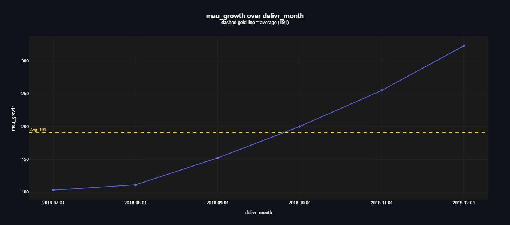
  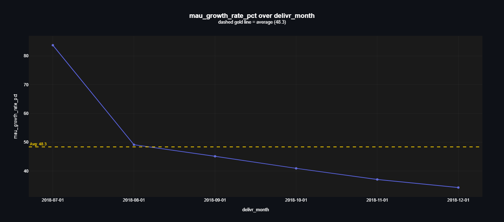
</p>

The left chart looks like acceleration: +103 new active users in July, +323 in December. The right chart measures each month against the one before it, and there growth drops from 84% to 34%.

Both charts are correct. The absolute number keeps climbing because the base keeps getting bigger. If you only report the left one to an investor, you are hiding a slowdown.

### 2. Revenue grew 17x while users grew 10x. The rest came from people ordering more often

Revenue is just active users × orders per user × average order value. Breaking it apart this way shows which lever actually moved:

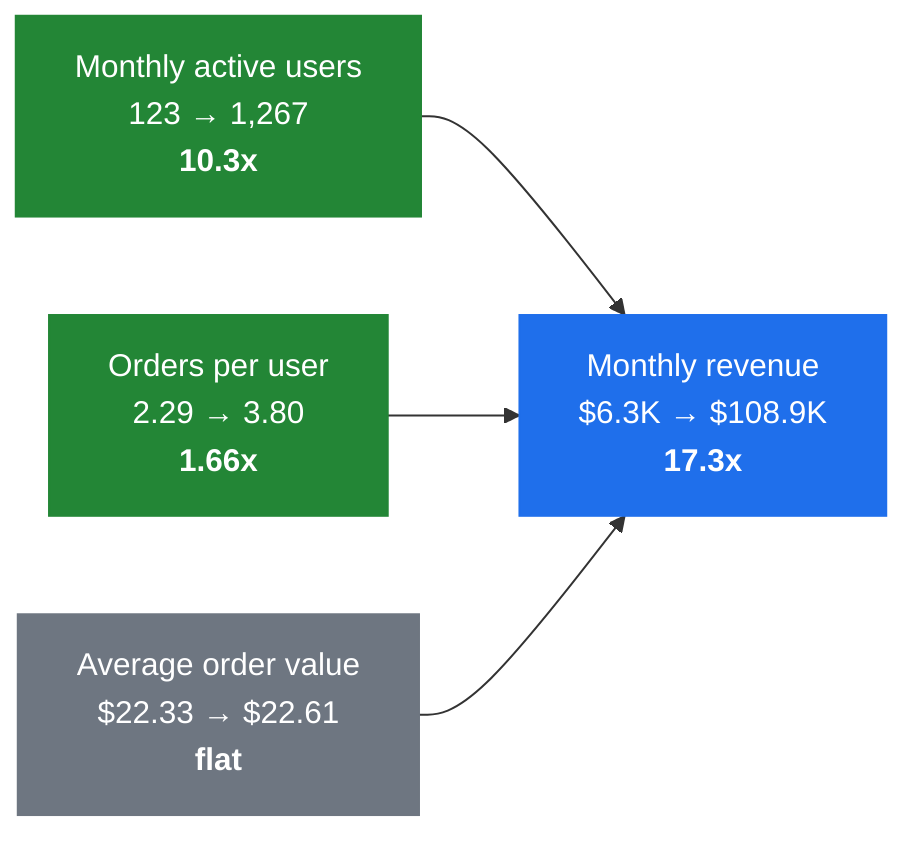

<p align="center">
  
  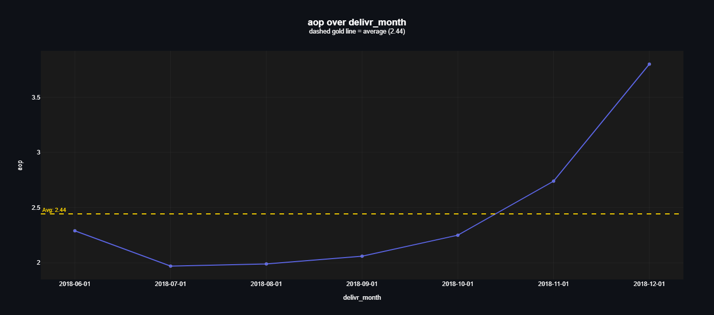
</p>

Revenue per user (ARPU) and orders per user have the same shape: a dip in July, then a steady climb that gets steep in November and December. Order value stayed around \$22 to \$23 every month and the margin never left 64.4 to 65.0%. So there were no price increases and no shift toward pricier meals. All of the per-user gain came from frequency.

This also explains a pattern I kept seeing while working. Stickiness (DAU ÷ MAU, up from 7.4% to 11.9%) and month-over-month order growth (down to 50% in September, then up to 86% in December) follow the same curve as ARPU, because they measure the same thing: users coming back more often.

<p align="center">
  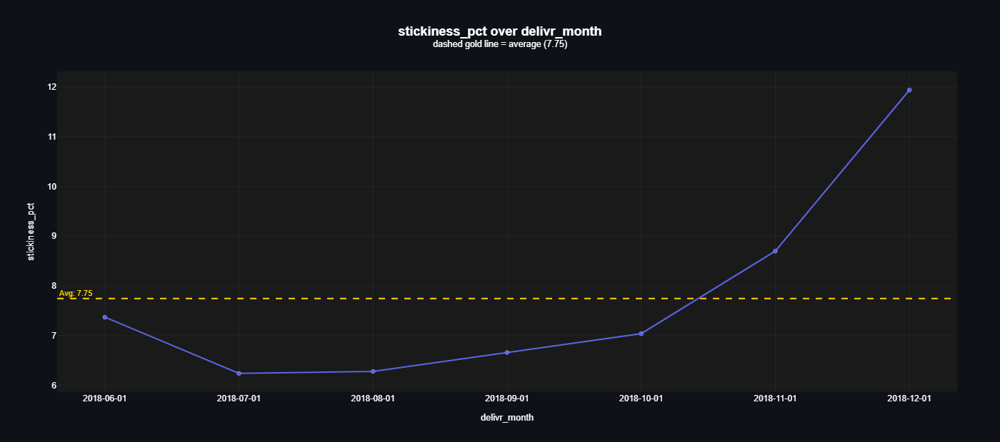
  
</p>

User growth is slowing (finding 1) while order growth is speeding up. The current users are carrying the business.

### 3. By December, 72% of active users were returning customers

<p align="center">
  
</p>

I split each month's active users into three groups: new (first order that month), retained (also ordered last month) and resurrected (came back after at least one month away). New users go from 100% of the base in June to 22% in December, and retained users go from 38% to 72%. Month-over-month retention climbed from 70% to 96%.

An MAU of 1,000 can mean 1,000 loyal customers or 1,000 people who try the app once and leave. MAU alone can't tell those apart. This split can, and for Delivr the answer is mostly loyal customers.

### 4. The eatery that brings in the most money is not the one that makes the most

<p align="center">
  
  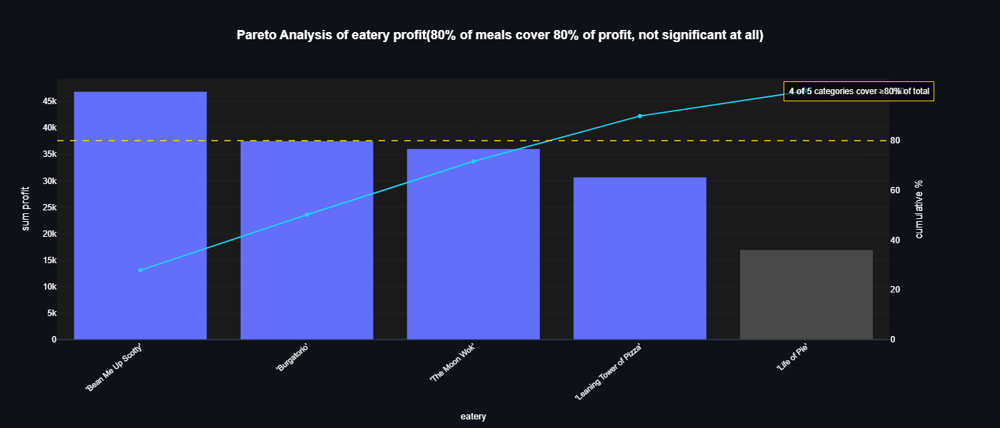
</p>

| Eatery | Revenue | Profit | Margin |
|---|---:|---:|---:|
| Burgatorio | \$71.8K | \$37.5K | 52.3% |
| Bean Me Up Scotty | \$60.7K | **\$46.9K** | 77.3% |
| The Moon Wok | \$60.8K | \$36.0K | 59.3% |
| Leaning Tower of Pizza | \$47.7K | \$30.7K | 64.3% |
| Life of Pie | \$19.3K | \$17.0K | **88.0%** |

Burgatorio leads on revenue and comes third on profit. The gap is visible at the meal level too. Meal 5, a Burgatorio item, is the single best seller at \$19.9K, yet it earns only 38.5% margin. Meal 11 from Bean Me Up Scotty sells 11% less and makes almost twice the profit (\$14.6K vs \$7.7K). A marketing budget spent by revenue rank would push the wrong restaurant.

Life of Pie is the odd one. It has the best margin on the platform and the weakest everything else: lowest revenue, lowest retention, lowest stickiness, lowest ARPU. Its economics are fine. Too few people order from it.

<p align="center">
  
  
</p>

### 5. Profit is spread across the customer base, with no whales

<p align="center">
  
</p>

The 80/20 rule doesn't hold here. It takes 794 of the 1,304 customers (61%) to reach 80% of profit. The top customer brought in \$408 of profit, about 0.2% of the total, so losing any one account barely registers. Orders tell the same story: 58% of them cover 80% of profit.

<p align="center">
  
  
</p>

Only 7 of 1,304 customers ordered once, and most ordered between 5 and 10 times. Per-user profit tracks revenue almost perfectly (r² = 0.99), which fits the flat margin in finding 2: Delivr doesn't run discounts that would make some big spenders unprofitable. The median customer brought in \$122 of profit against a mean of \$129. A handful of heavy users pull the mean up a little.

### 6. New users arrive in monthly waves

<p align="center">
  
  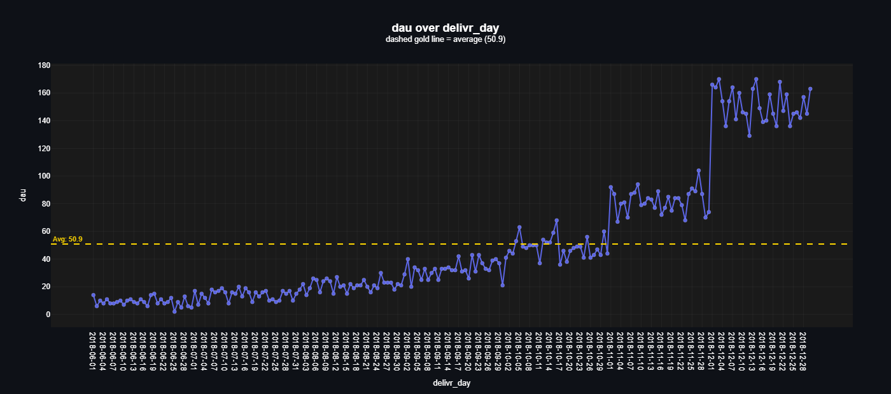
</p>

Weekly registrations spike about every four weeks, and each spike lands in the week that contains the 1st of a month. Daily active users jump in steps at the same points (look at 1 October, 1 November and, most clearly, 1 December). Two things could cause this: acquisition pushes at the start of each month, or the way this synthetic dataset was generated. With real data, that is the first question I'd take to the marketing team.

---

## The dataset

Delivr's data comes from DataCamp's *Analyzing Business Data in SQL* course. It has three tables and covers 1 June to 30 December 2018.

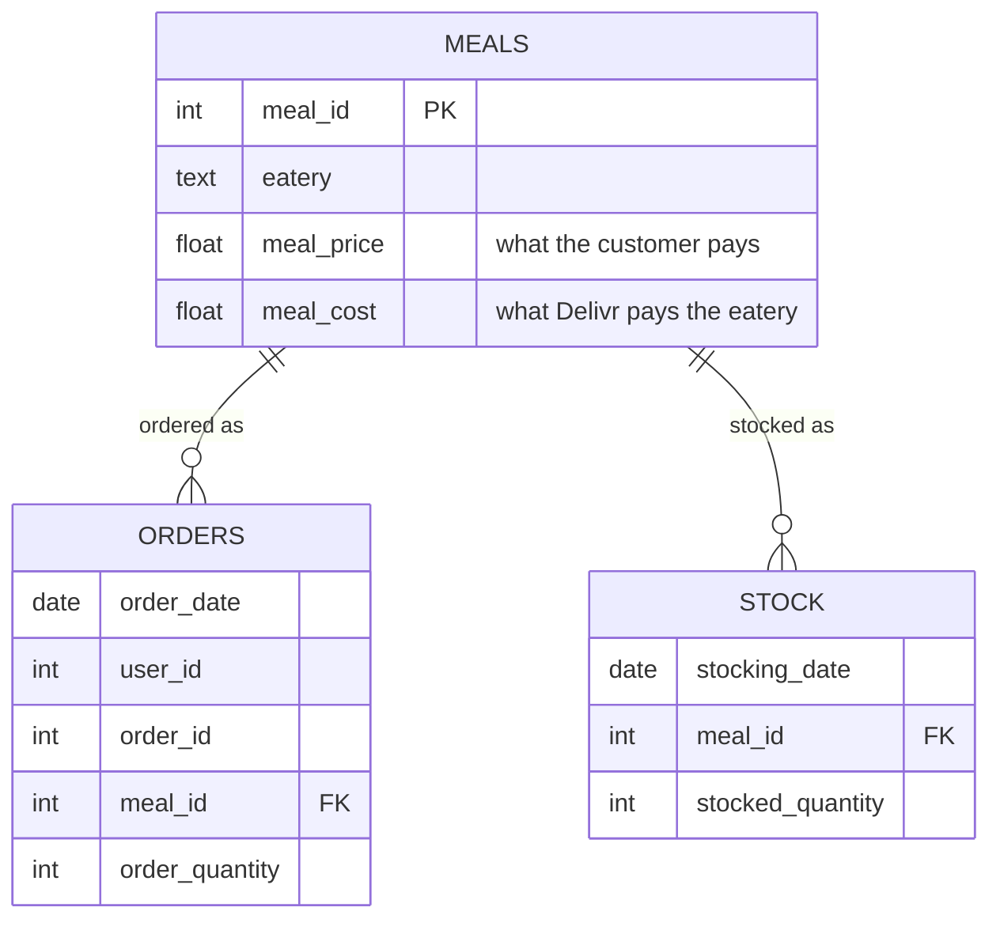

| Table | Rows | What one row is |
|---|---:|---|
| `meals` | 20 | a meal on the menu, with its eatery, price and cost |
| `orders` | 28,672 | one meal line inside an order (11,351 orders in total) |
| `stock` | 133 | a restocking event for a meal |

Some modelling choices shape every number above:

- The data has no signup table, so a user's registration date is the date of their first order.
- Revenue is `meal_price × order_quantity` and profit is `(meal_price - meal_cost) × order_quantity`. That makes profit a gross margin on meals. Delivery, marketing and payroll costs aren't in the data.
- Meal 19 (Life of Pie) is on the menu but was never ordered, so Life of Pie effectively has two meals.
- `stock` gets loaded but none of these notebooks use it. It belongs to the inventory chapter of the course, which I haven't done yet.

---

## How the analysis is organised

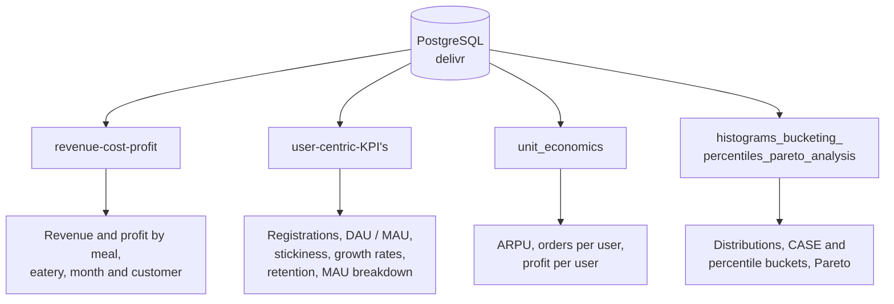

| Notebook | Question it answers | SQL it leans on |
|---|---|---|
| [`revenue-cost-profit`](revenue-cost-profit.ipynb) | Where does the money come from, and does more revenue mean more profit? | joins, `GROUP BY`, `date_trunc`, `SUM() OVER (PARTITION BY)` |
| [`user-centric-KPI's`](user-centric-KPI%27s.ipynb) | Are users growing, sticking around and coming back? | CTEs, `LAG()`, running totals, self-joins for retention, `generate_series` for a rolling 30-day MAU |
| [`unit_economics`](unit_economics.ipynb) | Is each user worth more over time? | per-period ratios with `NULLIF` guards |
| [`histograms_bucketing_percentiles_pareto_analysis`](histograms_bucketing_percentiles_pareto_analysis.ipynb) | How is value spread across users, orders, meals and eateries? | `CASE` bucketing, `percentile_cont`, cumulative shares |

All of the aggregation runs in Postgres. Python only receives the finished result and draws it.

<details>
<summary><b>More charts from the notebooks</b></summary>

<br/>

Revenue by month and weekly retention:

<p align="center">
  
  
</p>

Week-over-week retention went from the 20 to 35% range in summer to 56 to 59% in December. Month-over-month retention, platform-wide:

<p align="center">
  
</p>

</details>

<details>
<summary><b>Glossary of the KPIs</b></summary>

<br/>

| KPI | Plain meaning |
|---|---|
| DAU / MAU | Distinct users who ordered on a given day / in a given month |
| Stickiness | Average DAU ÷ MAU. At 7.75% the average active user orders on about 2.3 days a month |
| Growth rate | (this period - last period) ÷ last period |
| Retention rate | Share of last period's active users who were active again this period |
| Resurrected user | Active this month, inactive last month, but not new |
| ARPU | Revenue ÷ active users in the period |
| Pareto split | How few users (or orders, or meals) it takes to reach 80% of the total |

</details>

---

## Limits and what I'd do next

The data is synthetic, and some patterns (the month-start steps, retention near 96%) look cleaner than a real business usually does. Profit here leaves out delivery and acquisition costs. Adding those would make CAC and payback period possible, and then the question "is Delivr actually making money?" could be answered. The next steps I have in mind:

- Cohort retention curves (by signup month) instead of one retention number per month
- A promotion test on Life of Pie, since it has the highest margin and the least traffic
- The `stock` table, to measure how much of each meal was stocked and never sold

---

## Under the hood: the Python and Postgres side

This part isn't what a business reader needs, but it's what makes the notebooks reproducible from a clean machine with a single command.

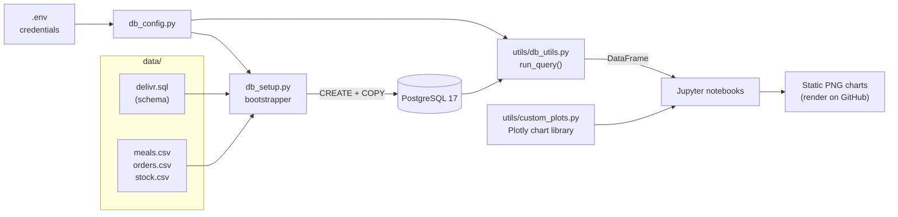

### `db_setup.py`: builds the database in one command

This script takes you from an empty Postgres server to a loaded `delivr` database. It's generic: the only project-specific part is a small `CONFIG` block (which SQL folder to run, which CSV goes into which table), so I can reuse it in other projects.

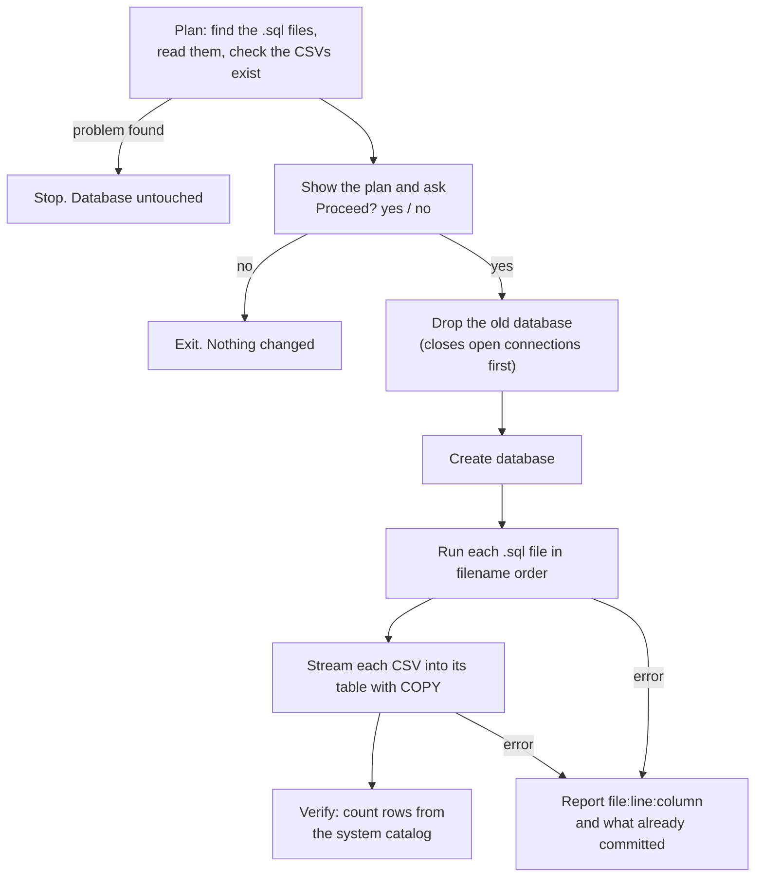

The parts I'm happiest with:

- It checks everything it can before deleting anything, so a typo in the config can't wipe the old database and then fail to build the new one.
- CSVs go straight into Postgres through `COPY`, the fastest way to bulk-load. Values land exactly as written in the file, and memory stays flat however big the file is. An optional pandas mode fixes the common "186 became 186.0" bug for integer columns that have gaps.
- When a SQL file fails, you get the file, line and column plus the offending line with a caret under the problem, instead of Postgres's bare `syntax error at or near`.
- It catches files that only the `psql` command-line tool can run (for example `\copy` or pg_dump's inline `COPY ... FROM stdin`) and explains what to change.
- At the end it reads the database back and lists every table with its real row count, so you see what actually landed.

### `utils/db_utils.py`: SQL in, DataFrame out

A notebook cell looks like this:

```python
from utils.db_utils import run_query
from utils.custom_plots import line_plot

mau = run_query('''
    SELECT date_trunc('month', order_date)::date AS delivr_month,
           count(DISTINCT user_id)               AS mau
    FROM orders
    GROUP BY delivr_month
    ORDER BY delivr_month;
''')

line_plot(df=mau, x='delivr_month', y='mau', avg_line=True)
```

`run_query` reuses one shared SQLAlchemy connection to Postgres, so the notebooks don't open a new one for every query, and returns the result as a pandas DataFrame. `execute_ddl` handles writes (`CREATE`, `UPDATE` and so on) inside a transaction that rolls back on error. Credentials live in a git-ignored `.env` file that `db_config.py` reads.

### `utils/custom_plots.py`: a personal chart library

This is about 4,700 lines of Plotly wrappers I wrote so that every chart in the project has the same dark theme and needs one line to call. It has bar, line, scatter with an OLS fit, ECDF, violin and box, Pareto, heatmaps and more, with extras like average lines, per-group averages, percent-of-total labels and outlier counts. The notebooks render to static PNG (`pio.renderers.default = "png"`) so the charts show up on GitHub. Remove that line to get interactive charts back.

### Run it yourself

You need PostgreSQL running locally and Python 3.11 or newer.

```bash
# 1. install dependencies (kaleido is what renders Plotly to PNG)
pip install pandas numpy scipy plotly kaleido sqlalchemy psycopg2-binary python-dotenv jupyterlab

# 2. create a .env file in the project root
DB_USER=postgres
DB_PASSWORD=your_password
DB_HOST=localhost
DB_PORT=5432
DB_NAME=delivr

# 3. build and load the database (type "yes" at the prompt)
python db_setup.py

# 4. open the notebooks
jupyter lab
```

### Project structure

```
Delivr-Business-Analysis/
├── data/
│   ├── delivr.sql              # table definitions
│   ├── meals.csv
│   ├── orders.csv
│   └── stock.csv
├── utils/
│   ├── db_utils.py             # run_query / execute_ddl
│   └── custom_plots.py         # Plotly chart library
├── assets/                     # charts used in this README
├── db_config.py                # reads credentials from .env
├── db_setup.py                 # one-command database bootstrap
├── revenue-cost-profit.ipynb
├── user-centric-KPI's.ipynb
├── unit_economics.ipynb
└── histograms_bucketing_percentiles_pareto_analysis.ipynb
```

---

<sub>Dataset and KPI framework from DataCamp's <i>Analyzing Business Data in SQL</i>. The first three chapters are covered here. The database tooling, chart library and analysis are my own.</sub>
